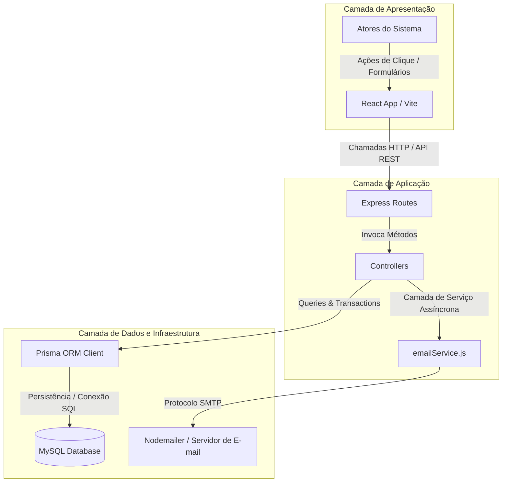
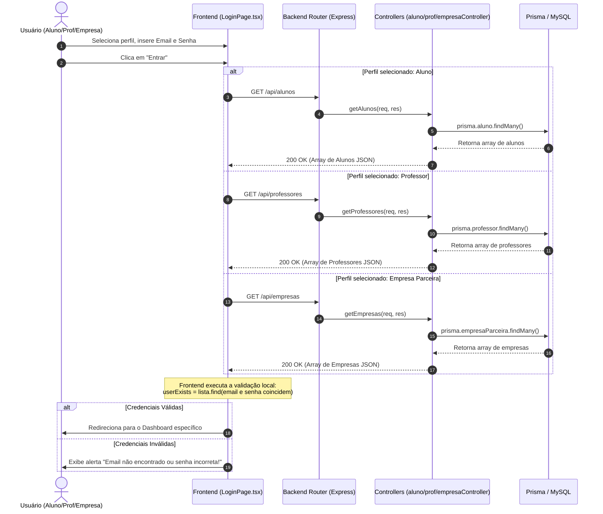
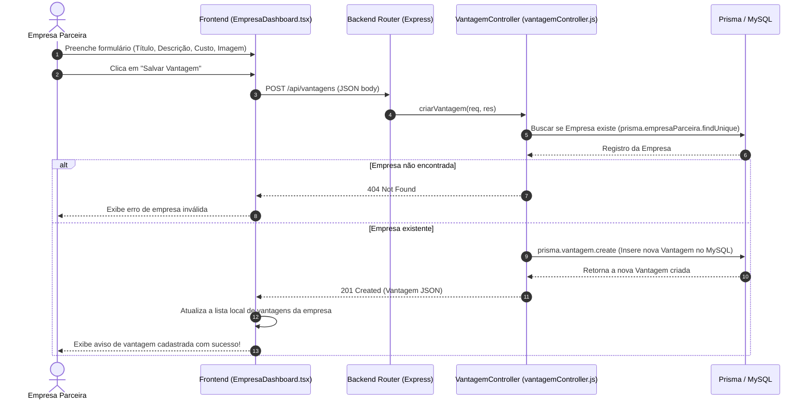

# 📐 Diagrama de Sequência Geral do Sistema de Moeda Estudantil

Este documento apresenta uma visão detalhada do fluxo de mensagens e interações de sequência entre os componentes do **Sistema de Moeda Estudantil**. O ecossistema é baseado em uma arquitetura **Full-Stack desacoplada**:

*   **Frontend**: React + TypeScript (Vite, Tailwind CSS, MUI, Framer Motion)
*   **Backend REST**: Node.js + Express.js
*   **Acesso a Dados**: Prisma ORM
*   **Banco de Dados**: MySQL
*   **Serviços Externos**: Nodemailer (Serviço de Envio de E-mails)

---

## 🏗️ Visão Geral da Arquitetura de Comunicação

Para facilitar a leitura dos fluxos, os diagramas a seguir representam as operações principais do sistema de ponta a ponta. Eles utilizam a sintaxe **Mermaid** para renderizar gráficos de fluxo interativos e limpos diretamente no GitHub ou no visualizador markdown do seu IDE.

---

## 1. Fluxo de Autenticação e Entrada no Sistema
O sistema implementa uma validação local no frontend que consome a base de dados de alunos, professores e empresas para conceder acesso ao dashboard adequado de forma ágil.

---

## 2. Fluxo de Distribuição de Moedas (Professor ➔ Aluno)
Este fluxo representa o professor recompensando um aluno. Ao submeter a quantia e a justificativa, o backend executa uma **transação atômica** para garantir a segurança dos saldos e notifica as partes por e-mail.

```mermaid
sequenceDiagram
    autonumber
    actor Prof as Professor
    participant Front as Frontend (ProfessorDashboard.tsx)
    participant Router as Backend Router (Express)
    participant Ctrl as TransacaoController (transacaoController.js)
    participant DB as Prisma / MySQL
    participant Nodemailer as emailService (Nodemailer)
    actor Aluno as Aluno (Notificado)

    Prof->>Front: Seleciona Aluno, insere Valor e Motivo
    Prof->>Front: Clica em "Enviar Moedas"
    Front->>Router: POST /api/transacoes/enviar (JSON body)
    Router->>Ctrl: enviarMoedas(req, res)
    
    Note over Ctrl: Valida dados básicos (campos vazios, valor <= 0)

    Ctrl->>DB: Buscar dados do Professor (prisma.professor.findUnique)
    DB-->>Ctrl: Registro do Professor
    
    Ctrl->>DB: Buscar dados do Aluno (prisma.aluno.findUnique)
    DB-->>Ctrl: Registro do Aluno

    alt Professor ou Aluno não existem
        Ctrl-->>Front: 404 Not Found
        Front-->>Prof: Exibe mensagem de erro
    else Sucesso na validação

        rect rgb(30, 41, 59)
            Note over Ctrl, DB: Execução da Transação no Banco ($transaction)
            Ctrl->>DB: tx.aluno.update (Incrementa saldo do Aluno)
            Ctrl->>DB: tx.transacao.create (Registra histórico da transação)
            DB-->>Ctrl: Confirmação e dados criados
        end

        Note over Ctrl, Nodemailer: Processamento Assíncrono de E-mails
        par Notificar Aluno
            Ctrl->>Nodemailer: sendCoinTransferEmailToAluno(...)
            Nodemailer-->>Aluno: Envia e-mail de recebimento (Valor, Professor, Motivo)
        and Notificar Professor
            Ctrl->>Nodemailer: sendCoinTransferEmailToProfessor(...)
            Nodemailer-->>Prof: Envia e-mail de confirmação de envio
        end

        Ctrl-->>Front: 201 Created (Objeto Transação)
        Front-->>Prof: Exibe notificação de sucesso via Sonner
    end
```

---

## 3. Fluxo de Resgate de Vantagens (Aluno ➔ Empresa)
Quando o aluno escolhe adquirir uma vantagem na plataforma, o saldo é debitado e um cupom único (código alfanumérico aleatório) é gerado e despachado para ambas as partes por e-mail para validação posterior.

```mermaid
sequenceDiagram
    autonumber
    actor Aluno as Aluno
    participant Front as Frontend (AlunoDashboard.tsx)
    participant Router as Backend Router (Express)
    participant Ctrl as VantagemController (vantagemController.js)
    participant DB as Prisma / MySQL
    participant Nodemailer as emailService (Nodemailer)
    actor Empresa as Empresa Parceira (Notificada)

    Aluno->>Front: Visualiza a Vitrine de Vantagens
    Aluno->>Front: Clica em "Resgatar" na Vantagem desejada
    Front->>Router: POST /api/vantagens/resgatar (JSON body)
    Router->>Ctrl: resgatarVantagem(req, res)

    Ctrl->>DB: Buscar dados do Aluno
    DB-->>Ctrl: Retorna Aluno (saldo atual)
    Ctrl->>DB: Buscar Vantagem e Empresa Parceira
    DB-->>Ctrl: Retorna Vantagem e dados da Empresa

    alt Saldo do Aluno < Custo da Vantagem
        Ctrl-->>Front: 400 Bad Request (Saldo insuficiente)
        Front-->>Aluno: Exibe "Saldo insuficiente para resgatar..."
    else Já resgatou a vantagem anteriormente
        Ctrl->>DB: Buscar se já existe resgate (findFirst)
        DB-->>Ctrl: Resgate existente encontrado
        Ctrl-->>Front: 400 Bad Request (Já resgatou)
        Front-->>Aluno: Exibe "Você já resgatou esta vantagem."
    else Saldo Suficiente e Válido
        Note over Ctrl: Gerar código único alfanumérico (ex: RESG-F8A2D9)
        
        rect rgb(30, 41, 59)
            Note over Ctrl, DB: Execução da Transação no Banco ($transaction)
            Ctrl->>DB: tx.aluno.update (Decrementa saldo do Aluno)
            Ctrl->>DB: tx.resgate.create (Cria cupom com o código alfanumérico)
            DB-->>Ctrl: Retorna dados do Resgate
        end

        Note over Ctrl, Nodemailer: Processamento Assíncrono de E-mails
        par Notificar Aluno
            Ctrl->>Nodemailer: sendResgateEmailToAluno(...)
            Nodemailer-->>Aluno: Envia e-mail com cupom gerado
        and Notificar Empresa
            Ctrl->>Nodemailer: sendResgateEmailToEmpresa(...)
            Nodemailer-->>Empresa: Envia e-mail com dados do resgate e código do cupom
        end

        Ctrl-->>Front: 201 Created (Objeto Resgate com Código)
        Front->>Front: Atualiza saldo local e exibe cupom resgatado
        Front-->>Aluno: Notificação de resgate efetuado com sucesso
    end
```

---

## 4. Fluxo de Gerenciamento de Vantagens (Empresa Parceira)
As empresas cadastradas utilizam este fluxo para alimentar a plataforma com novas ofertas, que subsequentemente ficarão disponíveis na vitrine do aluno.

---

> [!NOTE]
> **Integridade Transacional:** Toda alteração de saldos (tanto no crédito de moedas quanto no débito durante os resgates) é englobada em comandos do tipo `Prisma.$transaction`. Isso evita inconsistências no banco de dados em cenários de concorrência ou falhas de conectividade.
